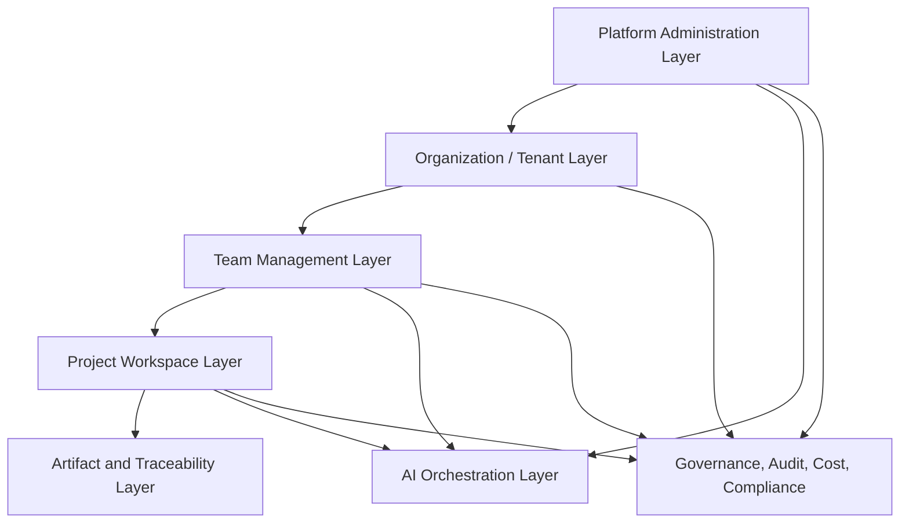
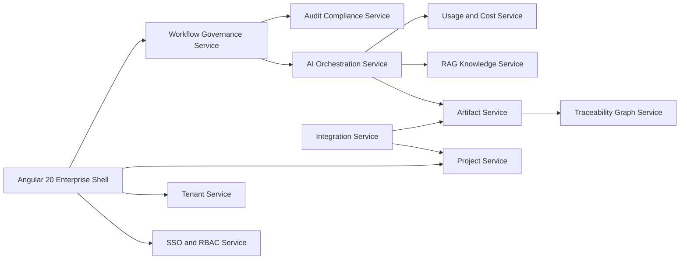
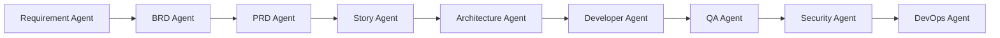
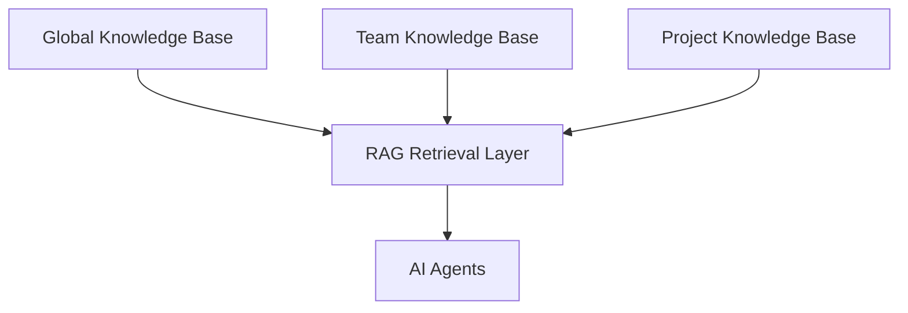
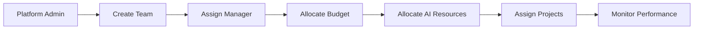
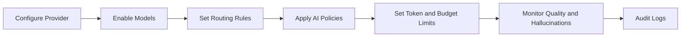
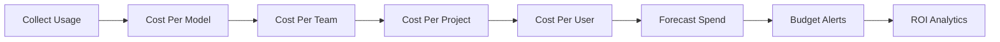

# SDLC AI Orchestrator Enterprise Architecture

## Vision

SDLC AI Orchestrator is a hierarchical multi-tenant Enterprise AI Delivery Operating System. It supports platform administrators, organization administrators, team managers, and project users across thousands of users, hundreds of teams, and many concurrent AI-driven projects.

The system is not a single-project tool. It is a layered enterprise SaaS platform that governs AI providers, tenants, teams, projects, knowledge, workflows, artifacts, approvals, audit history, and cost.

## Platform Layers



## Navigation Hierarchy

### Platform Admin Navigation

- AI Control Tower
- Tenant Management
- Team Management
- Roles and Permissions
- AI Providers
- Model Routing
- Usage Monitoring
- AI Governance
- Cost Management
- Enterprise Integrations
- Audit Compliance
- Global Knowledge
- Prompt Library

### Team Manager Navigation

- Team Workspace
- Portfolio Center
- Approval Workflows
- Sprint Delivery
- Collaboration
- Risk Intelligence
- Cost ROI Center
- Team Knowledge

### Project User Navigation

- Project Workspace
- AI Command Center
- Project Digital Twin
- Requirement Studio
- AI Orchestration
- Traceability Galaxy
- Impact Simulator
- Requirement Versions
- Impact Engine
- Knowledge Brain
- AI Architect Studio
- Executive War Room
- Project Control Tower

## User Hierarchy

| Role | Scope | Main Permissions |
|---|---|---|
| Platform Admin | All tenants | Configure providers, API keys, routing, token limits, budgets, global templates, audit, security |
| Organization Admin | Assigned tenant | Manage organization teams, projects, policy overrides, tenant knowledge |
| Team Manager | Assigned teams | Create teams, assign managers, allocate budgets, assign projects, monitor performance |
| Business Analyst | Assigned projects | Upload requirements, analyze ambiguity, generate BRDs, manage requirement versions |
| Product Owner | Assigned projects | Review PRDs, approve stories, manage priorities, release scope |
| Architect | Assigned projects | Review architecture, API contracts, deployment, NFRs |
| Developer | Assigned projects | Use developer prompts, sync work items, update implementation status |
| QA Engineer | Assigned projects | Generate tests, review coverage, approve QA artifacts |
| DevOps Engineer | Assigned projects | Configure CI/CD, deployment architecture, integrations |
| Viewer | Assigned scope | Read dashboards, artifacts, reports, traceability |

## Permission Matrix

| Capability | Platform Admin | Org Admin | Team Manager | BA | PO | Architect | Developer | QA | DevOps | Viewer |
|---|---|---|---|---|---|---|---|---|---|---|
| Manage tenants | Yes | No | No | No | No | No | No | No | No | No |
| Manage teams | Yes | Yes | Limited | No | No | No | No | No | No | No |
| Configure AI providers | Yes | Limited | No | No | No | No | No | No | No | No |
| Configure model routing | Yes | Limited | No | No | No | No | No | No | No | No |
| Upload requirements | Yes | Yes | Yes | Yes | Limited | No | No | No | No | No |
| Generate BRD/PRD | Yes | Yes | Yes | Yes | Yes | No | No | No | No | No |
| Generate architecture | Yes | Yes | Yes | No | Limited | Yes | Limited | No | Yes | No |
| Generate developer prompts | Yes | Yes | Yes | No | Limited | Yes | Yes | No | Yes | No |
| Generate test cases | Yes | Yes | Yes | No | Limited | No | Limited | Yes | No | No |
| Approve artifacts | Yes | Yes | Limited | Limited | Yes | Yes | No | Yes | Limited | No |
| Export audit reports | Yes | Yes | Limited | No | No | No | No | No | No | No |
| View dashboards | Yes | Yes | Yes | Yes | Yes | Yes | Yes | Yes | Yes | Yes |

## Core Platform Architecture



## Database Schema

### Tenant and Identity

```sql
tenants (
  id uuid primary key,
  name text not null,
  status text not null,
  plan text,
  budget_limit numeric,
  created_at timestamptz
);

organizations (
  id uuid primary key,
  tenant_id uuid references tenants(id),
  name text not null,
  policy_profile_id uuid,
  created_at timestamptz
);

users (
  id uuid primary key,
  tenant_id uuid references tenants(id),
  email text unique not null,
  display_name text,
  status text,
  created_at timestamptz
);

roles (
  id uuid primary key,
  name text not null,
  scope text not null
);

user_role_assignments (
  user_id uuid references users(id),
  role_id uuid references roles(id),
  tenant_id uuid references tenants(id),
  organization_id uuid references organizations(id),
  team_id uuid,
  project_id uuid,
  primary key (user_id, role_id)
);
```

### Teams and Projects

```sql
teams (
  id uuid primary key,
  tenant_id uuid references tenants(id),
  organization_id uuid references organizations(id),
  name text not null,
  manager_user_id uuid references users(id),
  ai_budget_limit numeric,
  status text
);

projects (
  id uuid primary key,
  tenant_id uuid references tenants(id),
  team_id uuid references teams(id),
  name text not null,
  client_name text,
  health_score numeric,
  workflow_status text,
  ai_configuration_id uuid,
  created_at timestamptz
);

project_members (
  project_id uuid references projects(id),
  user_id uuid references users(id),
  project_role text,
  primary key (project_id, user_id)
);
```

### Requirements and Artifacts

```sql
requirements (
  id uuid primary key,
  project_id uuid references projects(id),
  requirement_key text,
  current_version_id uuid,
  quality_score numeric,
  stability_score numeric,
  approval_status text
);

requirement_versions (
  id uuid primary key,
  requirement_id uuid references requirements(id),
  version_number integer,
  content text,
  ai_summary text,
  approval_status text,
  created_by uuid references users(id),
  created_at timestamptz
);

artifacts (
  id uuid primary key,
  project_id uuid references projects(id),
  artifact_type text,
  artifact_key text,
  version_number integer,
  content jsonb,
  approval_status text,
  quality_score numeric,
  created_at timestamptz
);

trace_edges (
  id uuid primary key,
  project_id uuid references projects(id),
  source_type text,
  source_id uuid,
  target_type text,
  target_id uuid,
  impact_level text,
  confidence numeric
);
```

### AI Governance

```sql
ai_providers (
  id uuid primary key,
  name text not null,
  status text,
  encrypted_api_key_ref text,
  default_model_id uuid,
  fallback_model_id uuid
);

ai_models (
  id uuid primary key,
  provider_id uuid references ai_providers(id),
  name text not null,
  enabled boolean,
  context_window integer,
  cost_per_1k_input numeric,
  cost_per_1k_output numeric
);

model_routing_rules (
  id uuid primary key,
  tenant_id uuid references tenants(id),
  workload_type text,
  primary_model_id uuid references ai_models(id),
  fallback_model_id uuid references ai_models(id),
  token_limit integer,
  budget_limit numeric,
  policy jsonb
);

agent_runs (
  id uuid primary key,
  project_id uuid references projects(id),
  agent_type text,
  model_id uuid references ai_models(id),
  status text,
  input_tokens integer,
  output_tokens integer,
  cost numeric,
  quality_score numeric,
  started_at timestamptz,
  completed_at timestamptz
);
```

### Audit, Compliance, and Cost

```sql
audit_events (
  id uuid primary key,
  tenant_id uuid references tenants(id),
  actor_user_id uuid references users(id),
  event_type text,
  entity_type text,
  entity_id uuid,
  details jsonb,
  created_at timestamptz
);

approval_workflows (
  id uuid primary key,
  project_id uuid references projects(id),
  artifact_id uuid references artifacts(id),
  status text,
  current_step text,
  escalation_policy jsonb
);

usage_cost_events (
  id uuid primary key,
  tenant_id uuid references tenants(id),
  team_id uuid references teams(id),
  project_id uuid references projects(id),
  user_id uuid references users(id),
  model_id uuid references ai_models(id),
  tokens integer,
  cost numeric,
  created_at timestamptz
);
```

## Project Workspace Structure

```text
Project
|-- Requirements
|-- BRDs
|-- PRDs
|-- User Stories
|-- Architecture
|-- Developer Prompts
|-- Test Cases
|-- Traceability
|-- Impact Analysis
|-- Approvals
|-- Reports
```

Each project also owns:

- Team members
- Project roles
- Workflow settings
- AI configuration
- Knowledge sources
- Integration mappings
- Audit and approval history

## AI Agent Workflow



Admin controls:

- Enable or disable agents
- Reorder workflow
- Configure execution rules
- Select default and fallback models
- Set token and budget limits
- Require approval gates

## Knowledge Management Model



Knowledge levels:

- Global: enterprise SOPs, global templates, approved prompt library, coding standards
- Team: team practices, reusable examples, delivery playbooks
- Project: project requirements, decisions, source documents, client-specific rules

## Management Flows

### Team Management Flow



### Project Management Flow

```mermaid
flowchart LR
  Project[Create Project]
  Members[Assign Members]
  Config[Set Workflow and AI Config]
  Sources[Attach Knowledge Sources]
  Upload[Upload Requirements]
  Agents[Run AI Workflow]
  Artifacts[Review Artifacts]
  Approvals[Approve and Export]

  Project --> Members --> Config --> Sources --> Upload --> Agents --> Artifacts --> Approvals
```



### AI Governance Flow



### Cost Management Flow



## Component Architecture

### Angular Shell

- `app-shell`
- `role-layer-switcher`
- `tenant-context-selector`
- `role-aware-rail-navigation`
- `global-ai-search`
- `activity-stream`

### Platform Admin Components

- `ai-control-tower`
- `tenant-management-grid`
- `team-management-board`
- `roles-permission-matrix`
- `ai-provider-console`
- `model-routing-matrix`
- `usage-monitoring-dashboard`
- `global-knowledge-console`
- `prompt-library-manager`

### Team Components

- `team-workspace`
- `team-analytics-panel`
- `resource-allocation-board`
- `team-knowledge-panel`
- `portfolio-center`
- `approval-workflow-center`

### Project Components

- `project-workspace`
- `requirement-studio`
- `artifact-workbench`
- `project-digital-twin`
- `traceability-galaxy`
- `impact-analysis-engine`
- `ai-orchestration-center`
- `project-control-tower`

### Governance Components

- `ai-governance-center`
- `audit-compliance-hub`
- `cost-management-center`
- `enterprise-integrations-hub`
- `workflow-governance-center`

## Implementation Strategy

### Frontend

- Angular 20 standalone components
- Angular router with role-aware route guards
- Angular signals for navigation, tenant context, and graph state
- Angular Material 3 for dialogs, buttons, chips, menus, forms, and tables
- Tailwind CSS tokens for layout, spacing, glass surfaces, and responsive behavior
- SVG graph layers for workflow, traceability, dependency, and topology visuals
- SSE or WebSocket client for real-time AI activity

### Backend

- API gateway
- Auth and RBAC service
- Tenant service
- Team service
- Project service
- AI provider service
- AI orchestration service
- Workflow governance service
- Artifact service
- Traceability graph service
- Knowledge/RAG service
- Cost telemetry service
- Audit/compliance service
- Integration service

### Scalability

- Tenant-aware data partitioning
- Background job queues for AI workflows
- Event-driven audit and telemetry stream
- Caching for prompt templates and knowledge retrieval
- Per-tenant and per-team rate limiting
- Model routing fallback strategy
- Async export generation for audit and compliance reports

## Key Enterprise Outcomes

- Platform admins control AI providers, models, keys, cost, governance, and tenants.
- Team managers allocate budget, people, AI resources, and projects.
- Project users generate and govern complete SDLC artifact chains.
- Executives see usage, value, risk, cost, and delivery progress.
- Compliance teams get full audit evidence for user, AI, workflow, document, and approval activities.
